# LOCAL_2_GCP

## VCC Assignment 3

### Purpose

Set up a local VM using VirtualBox, implement scaling policies based on workload to scale new VMs in Cloud when workload is beyond a threshold.

### Solution Overview

- <b>Hybrid Architecture:</b> Combines a local VirtualBox VM (for stress testing) with auto-scaling GCP instance groups (for cloud compute).

- <b>Automated Scaling:</b>

  - Local VM Monitoring: Prometheus tracks CPU usage; triggers alerts via Alertmanager when exceeding 75%.

  - GCP Autoscaling: Flask service scales GCP instance groups up/down based on alerts (0–5 instances).

- <b>Job Execution:</b>

  - Stress Testing: Three job types (small, medium, large) simulate CPU load on VMs via SSH.

  - In-Memory Tracking: Flask service tracks VM utilization to route jobs and avoid overload.

- <b>Fault Handling:</b> Returns 503 Service Unavailable during scaling or overload, enabling client retries.

### Architecture Diagram of Proposal

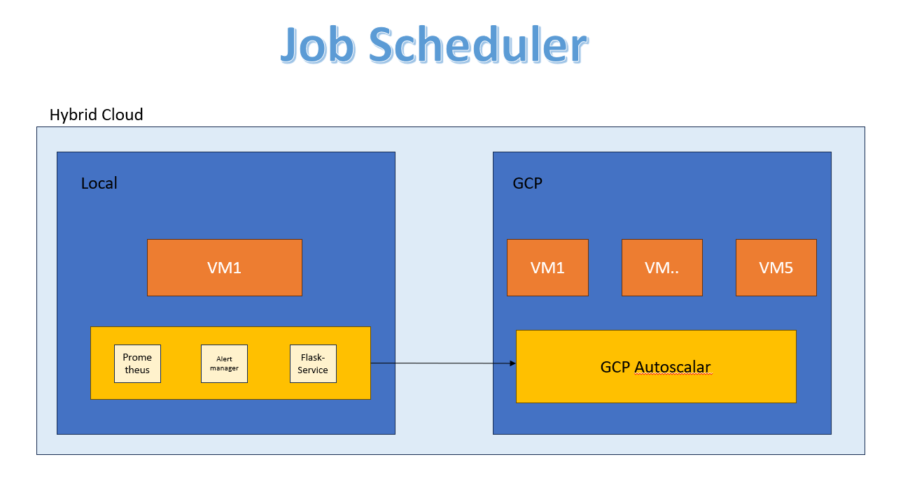

### How to do it

#### Initial Setup

- Install terraform
- Install Google Cloud SDK
- Clone this repository to you local machine and open a terminal in the cloned repo
- Using UI, login to GCP Console and Create the project. Then enable Compute Engine API
  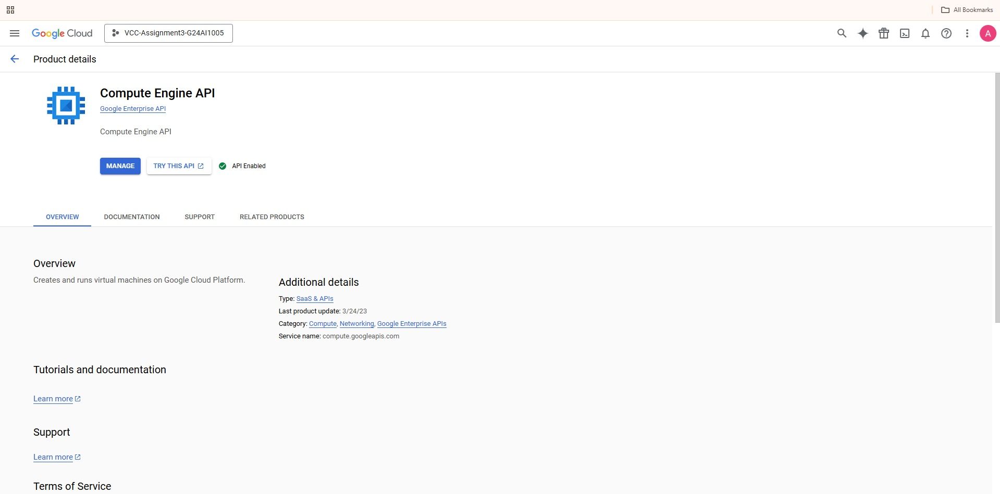

#### Authentication

Execute following commands in sequence

- Login to gcp account using SDK
  `gcloud auth login` (Login in the UI)
  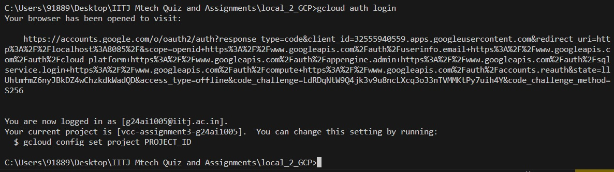
- Create a new service account that will be used for deployment using command `gcloud iam service-accounts create terraform-sa --display-name "Terraform Service Account" --project Project-name` (Replace Project-name with actual project name)
  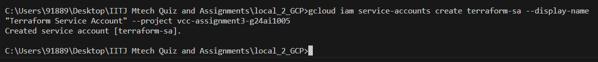
- Add the created service account to project with required IAM role using command `gcloud projects add-iam-policy-binding Project-name --member="serviceAccount:terraform-sa@Project-name.iam.gserviceaccount.com" --role="roles/editor"` (Replace Project-name with actual project name)
  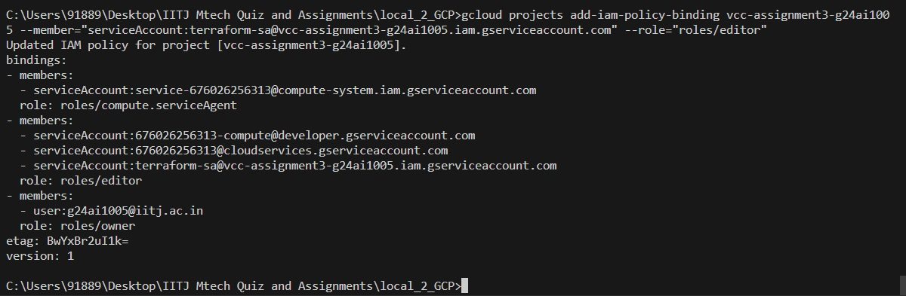
- Crreate a credentials file for terraform to use using command `gcloud iam service-accounts keys create credentials.json --iam-account=terraform-sa@Project-name.iam.gserviceaccount.com`. This should create a creadentials.json file. (Replace Project-name with actual project name)
  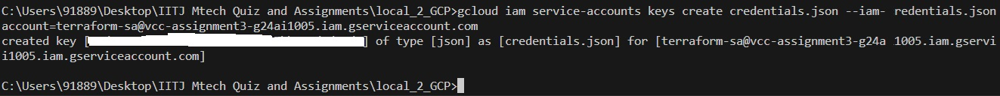

- Add creadentials file to git ignore using command `echo "credentials.json" >> .gitignore`
  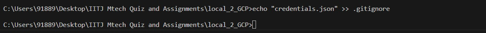

#### Prepare TF Code

Follow these steps to execute the code for deploying the components in GCP

- Go to `terraform.tfvars` file and update Project name

#### Deploy Architecture

Execute commands `terraform init`, `terraform plan -out file_name` and then `terraform apply file_name` to apply the terraform code

### Results

After applying following resources get created in GCP

- VPC
  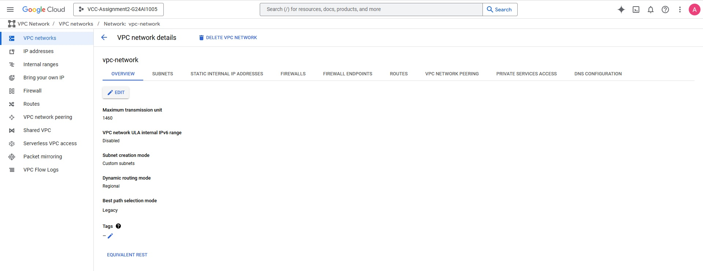
- Subnet
  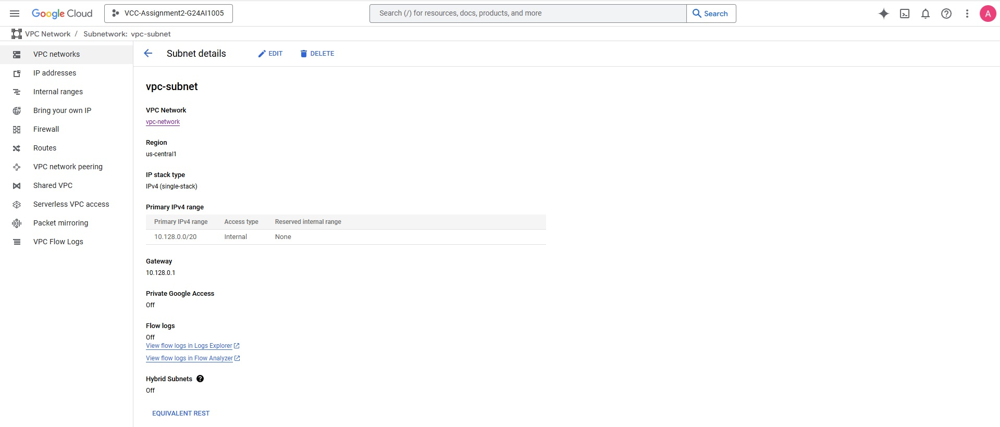
- Instance Group Template
  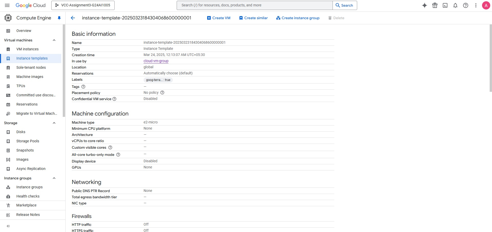
- Instance Group
  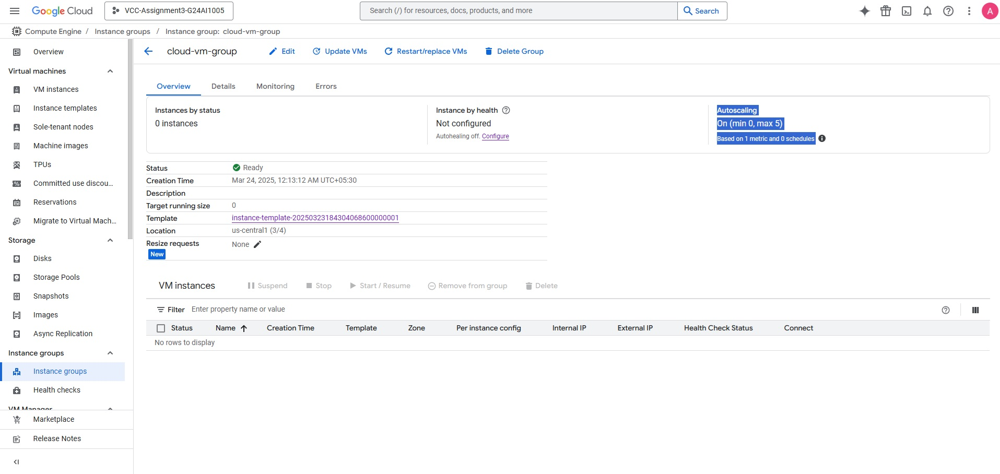
- Test VMs

  - VM1
    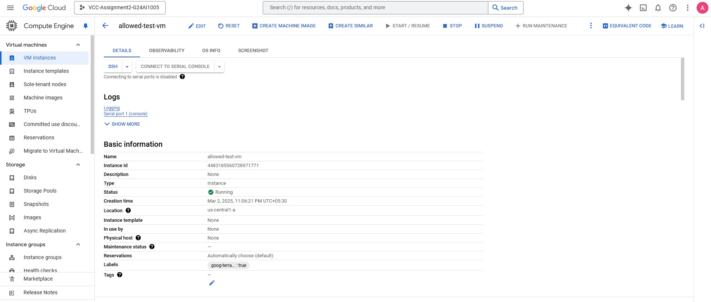
  - VM2
    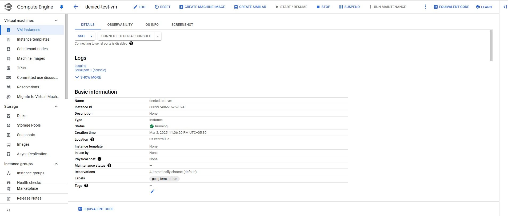

- Auto scaling
  When added workload on one of the VMs using `stress --cpu 1 --timeout 60`, auto scaling got triggered and the total numbers of VMs in the instance group increased to 5 (Max limit). And then after a cooldown period, the number came back to 2 (Min limit).
  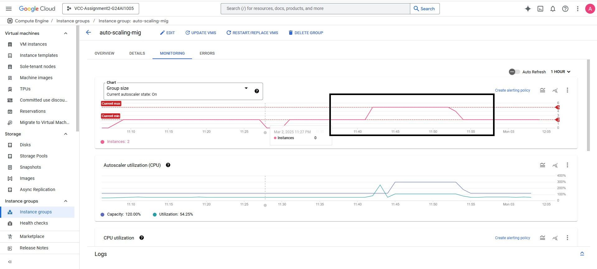
