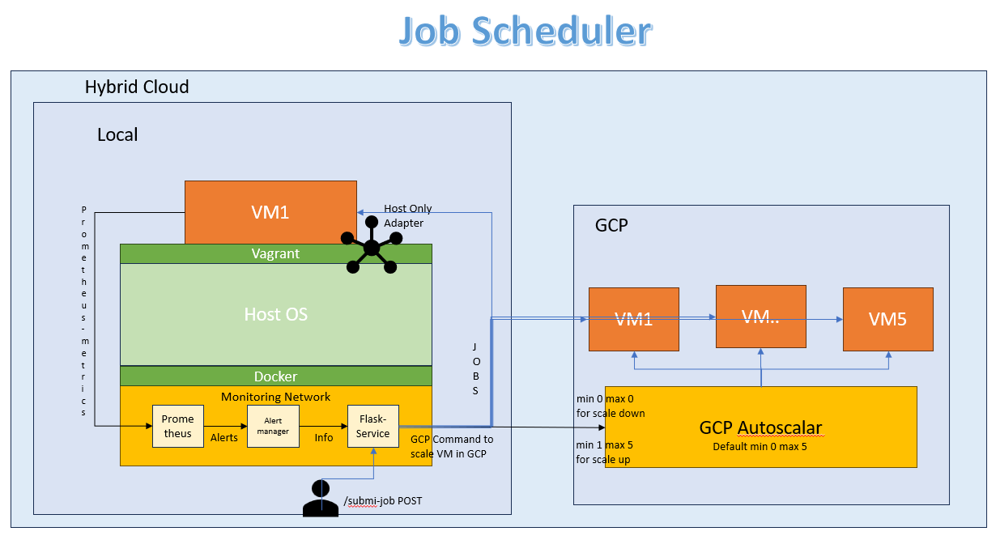
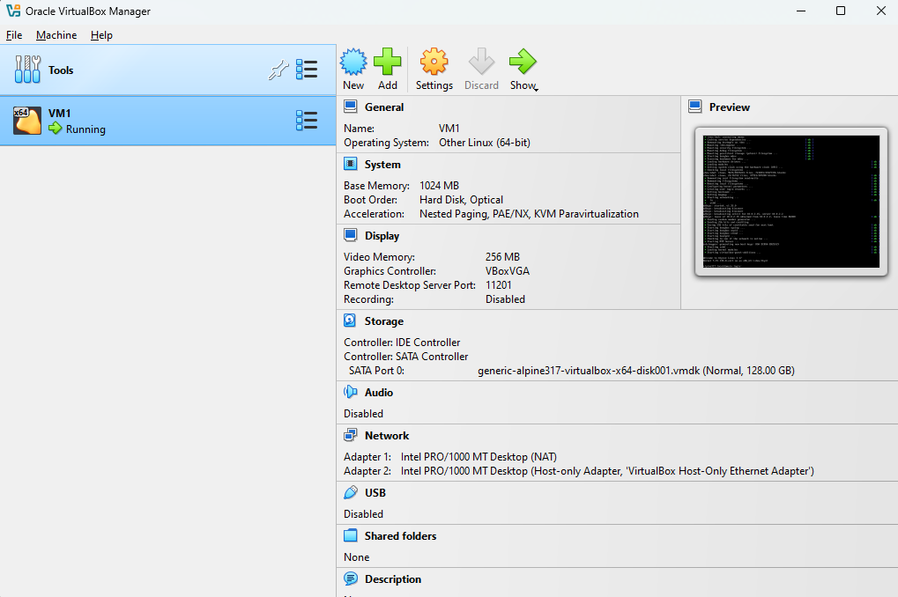
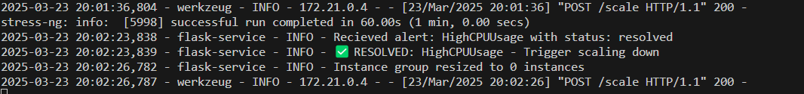

# LOCAL_2_GCP

## VCC Assignment 3

### Purpose

Set up a local VM using VirtualBox, implement scaling policies based on workload to scale new VMs in Cloud when workload is beyond a threshold.

### Solution Overview

- <b>Hybrid Architecture:</b> Combines a local VirtualBox VM (for stress testing) with auto-scaling GCP instance groups (for cloud compute).

- <b>Automated Scaling:</b>

  - Local VM Monitoring: Prometheus tracks CPU usage; triggers alerts via Alertmanager when exceeding 75%.

  - GCP Autoscaling: Flask service scales GCP instance groups up/down based on alerts (0–5 instances).

- <b>Job Execution:</b>

  - Stress Testing: Three job types (small, medium, large) simulate CPU load on VMs via SSH.

  - In-Memory Tracking: Flask service tracks VM utilization to route jobs and avoid overload.

- <b>Fault Handling:</b> Returns 503 Service Unavailable during scaling or overload, enabling client retries.

### Architecture Diagram of Proposal

### How to do it

#### Initial Setup

- Install vagrant
- Install terraform
- Install Google Cloud SDK
- Clone this repository to you local machine and open a terminal in the cloned repo
- Using UI, login to GCP Console and Create the project. Then enable Compute Engine API
  

#### Authentication

Execute following commands in sequence

- Login to gcp account using SDK
  `gcloud auth login` (Login in the UI)
  
- Create a new service account that will be used for deployment using command `gcloud iam service-accounts create terraform-sa --display-name "Terraform Service Account" --project Project-name` (Replace Project-name with actual project name)
  
- Add the created service account to project with required IAM role using command `gcloud projects add-iam-policy-binding Project-name --member="serviceAccount:terraform-sa@Project-name.iam.gserviceaccount.com" --role="roles/editor"` (Replace Project-name with actual project name)
  
- Crreate a credentials file for terraform to use using command `gcloud iam service-accounts keys create credentials.json --iam-account=terraform-sa@Project-name.iam.gserviceaccount.com`. This should create a creadentials.json file. (Replace Project-name with actual project name)
  

- Add creadentials file to git ignore using command `echo "credentials.json" >> .gitignore`
  

#### Local VM

Bring up the local VM using command `vagrant up`. The command will run over sometime and create the VM in VirtualBox

Ensure metrics are accessible over /metrics endpoint at port 9100

#### Prepare TF Code

Follow these steps to execute the code for deploying the components in GCP

- Go to `terraform.tfvars` file and update Project name

#### Deploy Architecture

Execute commands `terraform init`, `terraform plan -out file_name` and then `terraform apply file_name` to apply the terraform code

- `terraform init` will initialize things, will go through code and find dependencies and resolve them
  

- `terraform plan` will go through code and create a plan of what needs to be added, removed or updated, and list down the required changes as resource to be changed and attributes and values of that resource to be put into effect. The entire plan is very large for this use case, so only last part is in the screenshot. (Use of an outfile in command is preferred as given above)
  

- `terraform apply` will show the plan (as per the plan file if used (recommended)) as shown in `terraform-plan` command as prompt user for confirmation.
  

  After accepting (by typing 'yes' in prompt), the list of changes will be displayed aling with the status timely updated.
  

#### GCP Depployment

After applying following resources get created in GCP

- Instance Group Template
  

- Instance Group With No VM and Autoscaling enabled upto 5 VMs.
  

- Instance Group With startup script.
  

- Firewall policy to allow ssh
  

#### Deploy Monitoring, Alerting and Scaling stack

Execute command `docker-compose p -d --build` to start the prometheus, alertmanager and flask-service containers

Verify the services are up and running using `docker-compose ps` command

Check Prometheus Service at port 9090, ui should be accessible at `http://localhost:9090/`. Use query `100 * (1 - avg by (instance) (irate(node_cpu_seconds_total{mode="idle"}[1m])))` under `Graph` tab, to visualize average CPU utilization per minute.

Ensure Alert is configured under `Alerts` tab at `http://localhost:9090/`

Check Alertmanager Service at port 9093, ui should be accessible at `http://localhost:9093/`.

#### Job

This project uses fake jobs. Fake jobs are created by sending POST API call to flask-service. When Flask-service receives an API call to submit a job, Flask service looks for all VMs with load less than 75% CPU Utilization(threshold). When it finds a VM, then it sends over the fake job to that node (stress command to mock CPU utilization).

Jobs are of 3 types

- <b>Small</b> Creates a load of 40% for 5 seconds
- <b>Medium</b> Creates a load of 80% for 60 seconds
- <b>Large</b> Creates a load of 80% for 4 Minutes

on a VM with CPU utilization below 75%

#### Scaling

Scaling event happens when prometheus detects CPU utilization of local VM being more than 75% for 10 seconds. The alert is then created and is sent over to Flask-service via AlertManager. FlaskService then updates autoscalar property to have minimum of 1 replica and maximum of 5 replicas, causing 1 VM creation in GCP. This allows instance group to be scalable upto 5 VMs by GCP Autoscalar (again based on 75% threshold). When local VM is recovered and CPU usage falls below threshold, Flask-service updates autoscalar property to allow minimum 0 and maximum 0 replica, mandating instance group to have no VMs.

#### Simulation

Trigger POST API call to `/scale` endpoint in Flask-service from small job to simulate a load of 40% for 5 seconds

Request goes to local VM, prometheus graph

Trigger POST API call to `/scale` endpoint in Flask-service from medium job to simulate a load of 40% for 5 seconds
Note: This will invoke scaling and local VM will be above 75% utlization for around 1 minute

Request goes to local VM, prometheus graph

Prometheus creates a pending alert until CPU utilization is greater than 75% for 10 seconds

After approx 10 seconds alert is fired to Alertmanager

Alert is recieved in alertmanager and forwarded to flask service

Flask Service scales VM when it is informed by AlertManager

VM is created in GCP Instance Group and Autoscaling policy is updated

After sometime, Alert resolves as the stress gets timed out. When CPU usage is lower than threshold, alert is resolved and becomes green in Prometheus, is removed from Alertmanager and notifies to flask service which then in turn scales down the VM in GCP instance group

Instance is removed from GCP and instance group autoscalar policy is updated

Triggering API calls for large job, followed by medium
Sends first large job to local VM, local VM gets loaded and then alerts are created and propogated to flask-service and new VM is added in GCP, similar to steps shown above

Flask-service updates GCP Autoscaling property and new added VM is added with name: `vm-zw80`

Next medium job is assigned to the new VM in GCP as local VM was overloaded

Lets simulate a large after large, first large job goes to local VM, and this overloads local VM, causing series of actions as discussed above, ultimately to scaling up of a VM in GCP instance group

`vm-6wq5`, the newly created VM gets the next large job

`vm-6wq5` also showed increasing trend in CPU utilization, but it seems it was not enough to trigger autoscalingby GCP Autoscaler

Lets trigger stress command directly on a scaled up VM in GCP to simulate auto-scaling in GCP. Send a large job API trigger and wait for auto-scaling to happen in GCP.

Scaling up creates vm: `vm-4wr4` in gcp

ssh to `vm4wr4` and execute command `stress-ng --cpu 1 --timeout 240 --cpu-load 90` to put CPU under stress

GCP Autoscaling notices this and autoscaling kick in to create more VMs (scaled to 3)

